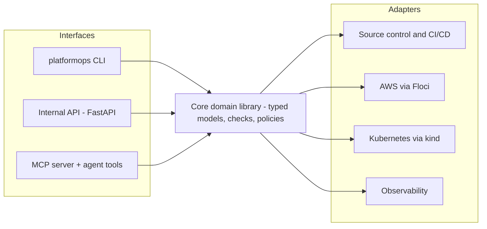

# PlatformOps Toolkit — Architecture Map and Release Ladder

This is the end-state of the project you build across this course: **PlatformOps v3.0**, a
Python operational toolkit that inspects, validates and troubleshoots services across source
control, CI/CD, AWS (via Floci, locally) and Kubernetes (via kind, locally). Keep this file
open as the course progresses — every module adds one block to this picture.

## The map

Three rules the whole course enforces:

1. **One core, many interfaces.** Domain logic lives once, in the tested core library. The
   CLI, the API and the agent tools are thin layers over the same functions.
2. **Adapters isolate the outside world.** AWS, Kubernetes, source control and observability
   are reached through adapters — swap Floci for real AWS without touching the core.
3. **Reads are free, writes are governed.** Anything that mutates goes through plan →
   approve → execute → audit. Agents get read-only tools by default.

## The release ladder — 37 tagged releases, v0.0 → v3.0

| Phase | Releases | Modules | What exists at the end |
|-------|----------|---------|------------------------|
| Foundation | v0.0 – v0.10 (11) | M2–M12 | A tested, typed, debuggable Python project: inventory reporter, service model, config validator, CLI, API client, concurrent health checks |
| Quality + agents + skills | v1.0 – v1.9 (11, incl. v1.2.1) | M13–M24 | Maintainable package, coding-agent harness, portable Agent Skills library, AWS inventory and cloud hygiene auditor |
| Governed operations | v2.0 – v2.13 (14) | M25–M38 | Approved-only remediation, release readiness, containerized CLI, Kubernetes inspector, incident context collector, internal API, MCP server, guardrails |
| Complete toolkit | v3.0 (1) | M39 | The capstone: all capabilities integrated and demonstrated end-to-end |

Small, frequent releases are the point: every module leaves the toolkit in a shippable,
tagged state — the same discipline you apply to production services.

## Annotate the map (3 prompts)

Answer inline, right here in this file. There is no checker for this section — it is your
own reference for the rest of the course.

1. **Which of the three interfaces would each scenario-8 consumer use?** (The on-call
   responder, a CI pipeline, an ops agent.)

   > Your answer:

2. **Where on the map does scenario 5 (bucket cleanup) live — which interface and which
   adapter?**

   > Your answer:

3. **Which release phase makes agents useful, and why does it come *after* testing and
   quality gates rather than before?**

   > Your answer:
